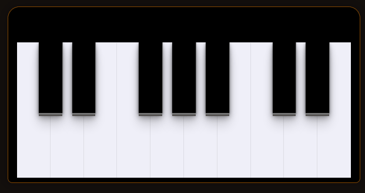

# PIANO| 

###  Manipulação de DOM - JS

Este projeto tem como principal objetivo explorar todas as nuances da manipulação do DOM, desde a criação dinâmica de elementos até a sua interação e manipulação de eventos. Estou imerso em diferentes técnicas e métodos para acessar, modificar e estilizar elementos HTML.

  
	
<b><a href="https://piano-estudo-de-dom.vercel.app/">Link</a></b>

### Habilidades utilizadas 💻👨🏻‍💻🖥

	   
		 
         

